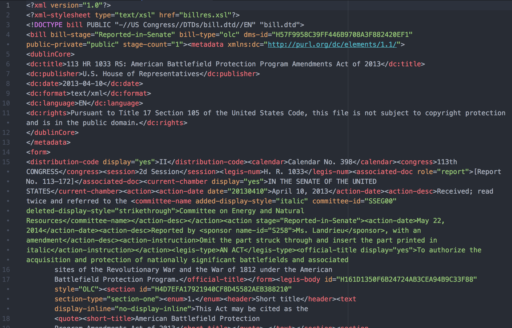
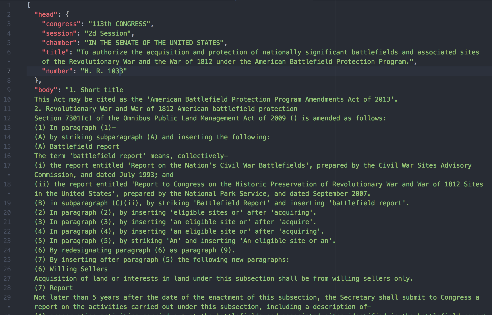
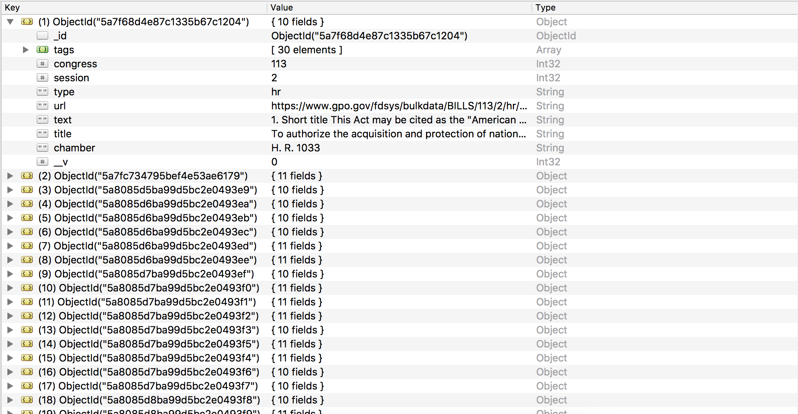

# BillScraper.js 📝📝📝
[](https://travis-ci.org/jeffreyshen19/BillScraper.js) [](https://codecov.io/gh/jeffreyshen19/BillScraper.js) [](https://badge.fury.io/js/bill-scraper) [](https://jeffreyshen19.github.io/BillScraper.js/out/)

A JavaScript API to scrape and analyze bills in Congress. Works for bills from the 113th, 114th, and 115th congress. **THIS PROJECT IS STILL UNDER DEVELOPMENT. DO NOT DOWNLOAD YET**.

## Table of Contents

* `docs`: Holds markdown files that explain the project in more detail.
* `examples`: Holds example code.
* `lib`: Holds all Javascript files
* `misc`: Hold all graphics for the README.md
* `runner`: Holds javascript files used to test the library while developing
* `test`: Holds all unit tests.

## Why?
The government hosts bulk data for all congressional bills at [gpo.gov/fdsys/bulkdata](https://www.gpo.gov/fdsys/bulkdata). However, this repository is horrible to use for developers, as bills are uploaded to unpredictable URLS as XML files. Each bill file is too structured, as XML style elements like paragraphs, bold text, and quotes are preserved, making it hard to parse the actual text of a bill.  

### What does this project do
 * **Returns full Congressional bill text and metadata from Congress.gov as JSON**. For example, the following code will convert the XML (on the top) into the JSON (on the bottom)

  ```
  var billScraper = require("bill-scraper");

  billScraper.getBill("BILLS-113hr1033rs", function(res){
    billScraper.printBill(res, function(parsedResult){
      console.log(JSON.stringify(parsedResult));
    });
  }, {session: 2});
  ```
  XML                      |  JSON                    
  :-----------------------:|:-----------------------:
       |  

  For more detailed examples, visit [examples/get_bills.js](examples/get_bills.js).

 * **Parses bills for key points and ideas**: This project generates "tags" for bills, allowing them to more easily searched. For instance, searching for all bills tagged with "battlefield".

  ```
  var billScraper = require("bill-scraper");

  billScraper.getBill("BILLS-113hr1033rs", function(res){
   billScraper.printBill(res, function(parsedResult){
     billScraper.tagBill(parsedResult, function(tags){
        console.log(tags);
     });
   });
  }, {session: 2});

  //Will return ['battlefield', 'sites','war','section','land','subsection','period','funds','appropriation','protection','revolutionary','public','sub','term','nations','civil','preservation','service','sellers','prohibition','purposes','person','entity','matter','influence','law','ratification','policy'];
  ```

  For more detailed examples, visit [examples/tag_bills.js](examples/tag_bills.js).

 * **Generates a searchable Mongo database of bills**: For example, the following code will locally cache a database (see photo below) of parsed, searchable bills.

  ```
  var billScraper = require("bill-scraper");
  var mongoose = require("mongoose");

  mongoose.connect("mongodb://localhost/bills");
  billScraper.generateDB("hr", 115, 1);
  ```

  

  For documentation on the Bill struct stored in the database, visit [BILL_TEMPLATE.md](docs/BILL_TEMPLATE.md) in `docs`, for more detailed examples, visit [examples/database.js](examples/database.js), and for information on searching bills, see the examples in [examples/search_bills.js](examples/search_bills.js).


### Documentation
* To get started, visit [GET_STARTED.md](docs/GET_STARTED.md) in `docs`.
* For a high-level overview of how the library is structured and developed, visit [ARCHITECTURE.md](docs/ARCHITECTURE.md) in `docs`.
* For examples of how to use the library, visit `examples`.
* Documentation for all the methods is available [here](https://jeffreyshen19.github.io/BillScraper.js/out/).

## Community

This repository encourages all users to contribute. Please read the [Code of Conduct](./CODE_OF_CONDUCT.md) and [Contributing.md](./CONTRIBUTING.md). For things to contribute, check out the issues or [TODO.md](./TODO.md).

### Datasets used

* [GPO Bill bulk data](https://www.gpo.gov/fdsys/bulkdata)

### Relevant libraries used

* [chai](https://github.com/chaijs/chai) and [mocha](https://github.com/mochajs/mocha): To run unit tests
* [jsdoc](https://github.com/jsdoc3/jsdoc): To generate function-level documentation
* [istanbul](https://github.com/gotwarlost/istanbul) and [codecov](https://github.com/codecov/codecov-node): To generate code coverage reports
* [mongoose](https://github.com/Automattic/mongoose) and [mongo](https://github.com/mongodb/mongo): For the database
* [retext](https://github.com/retextjs/retext) and [retext-keywords](https://github.com/retextjs/retext-keywords): To automatically tag bills by subject
* [htmlparser](https://github.com/tautologistics/node-htmlparser), [request](https://github.com/request/request), [soupselect](https://github.com/harryf/node-soupselect), and [xml2js](https://github.com/Leonidas-from-XIV/node-xml2js) for web scraping.

View the [package.json](package.json) for the full list of dependencies.

### Contributors

* [Jeffrey Shen](https://github.com/jeffreyshen19): Initial development. Currently maintains the code.
* [Amanda Li](https://github.com/dabao12321)
* [Malcolm Essaid](https://github.com/malcolmessaid)
* [Ryan Greenberg](https://github.com/optomal7)

View the full list of contributors [here](https://github.com/jeffreyshen19/BillScraper.js/graphs/contributors).

### License
This repository is licensed as CC0. See the [LICENSE](./LICENSE) for more information.

---

<p xmlns:dct="http://purl.org/dc/terms/" xmlns:vcard="http://www.w3.org/2001/vcard-rdf/3.0#">
  <a rel="license"
     href="http://creativecommons.org/publicdomain/zero/1.0/">
    
  </a>
  <br />
  To the extent possible under law,
  <a rel="dct:publisher"
     href="jeffreyshen.com">
    <span property="dct:title">Jeffrey Shen</span></a>
  has waived all copyright and related or neighboring rights to
  <span property="dct:title">BillScraper.js</span>.
This work is published from:
<span property="vcard:Country" datatype="dct:ISO3166"
      content="US" about="jeffreyshen.com">
  United States</span>.
</p>
