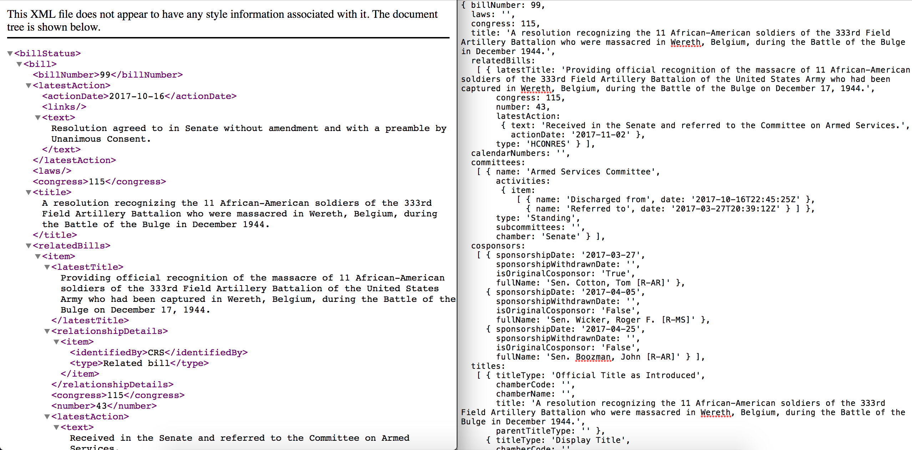

# BillScraper.js 📝📝📝
   

A JavaScript API to scrape and analyze bills in Congress. Works for bills from the 113th, 114th, and 115th congress. **THIS PROJECT IS STILL UNDER DEVELOPMENT. DO NOT DOWNLOAD YET**.

## Table of Contents

* `docs`: Holds markdown files that explain the project in more detail.
* `examples`: Holds example code.
* `lib`: Holds all Javascript files
* `misc`: Hold all graphics for the README.md
* `runner`: Holds javascript files used to test the library while developing
* `test`: Holds all unit tests.

## Why?
The current repository for bulk bill data is horrible to use for both citizens and developers. As shown in the gif below, bills are uploaded as XML files in a giant folder, which makes programming any projects that involves congressional data cumbersome.

### What does this project do
 * Returns full Congressional bill text and metadata from Congress.gov as JSON. For example, it converts the XML (on the left) into concise, usable JSON (on the right)

 

 * Parses bills for key points and ideas.
 * Powerful filtering and searching.

### Documentation
* To get started, visit [GET_STARTED.md](docs/GET_STARTED.md) in `docs`.
* For a high-level overview of how the library is structured and developed, visit [ARCHITECTURE.md](docs/ARCHITECTURE.md) in `docs`.
* For examples of how to use the library, visit `examples`.
* Documentation for all the methods is available [here](https://jeffreyshen19.github.io/BillScraper.js/out/).

## Community

This repository encourages all users to contribute. Please read the [Code of Conduct](./CODE_OF_CONDUCT.md) and [Contributing.md](./CONTRIBUTING.md). For things to contribute, check out the issues or [TODO.md](./TODO.md).

### Datasets used

* [GPO Bill bulk data](https://www.gpo.gov/fdsys/bulkdata)

### Relevant libraries used

### Contributors

### License
This repository is licensed as CC0. See the [LICENSE](./LICENSE) for more information.

---

  
   
  To the extent possible under law,
  <a rel="dct:publisher"
     href="jeffreyshen.com">
    Jeffrey Shen</a>
  has waived all copyright and related or neighboring rights to
  BillScraper.js.
This work is published from:

  United States.

